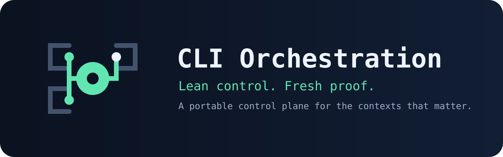

<p align="center"></p>

# TacticSwitch

**Use the right formation for the work.**

A portable, CLI-neutral control plane that chooses the minimum sufficient execution tactic for each development task. Clear local work stays direct; material or uncertain work gets only the independent contexts it needs. TacticSwitch brings that lean routing contract to Codex CLI, Claude Code, and GitHub Copilot CLI without replacing your methodology or task system.

[Quick start](#quick-start) · [Routing](#how-it-routes) · [Evidence](#proof-with-boundaries) · [Compatibility](#compatibility) · [Docs](#go-deeper) · [Contributing](CONTRIBUTING.md)

> [!IMPORTANT]
> Release 2.0.0 is ready for evaluation, not a claim of production-proven multi-CLI support; all three adapters are **experimental**. The only recorded route benchmark is a narrow Codex fixture, and its orchestrated routes were blocked by unavailable collaboration threads.

## Stop using one formation for every task

Agent workflows often choose between one overloaded context—including self-review—or a committee of fresh agents for every change. The first weakens independence; the second multiplies reads, handoffs, latency, tokens, and conflict risk.

TacticSwitch uses the **minimum sufficient topology**:

```text
clear + local + low risk                → direct execution
material + well specified              → Implementer → fresh Verifier
material + unclear scope/dependencies   → Scout → Implementer → fresh Verifier
genuinely independent read-only work    → minimum useful parallel contexts
```

One active writer owns overlapping files. Related work stays together as a context-affinity batch. A Verifier is fresh because it did not implement or own the batch—not because it must use a different model.

## Quick start

Requirements: Python 3.10+ and at least one target CLI. OpenSpec is optional.

```bash
python scripts/install.py --scope project --project /path/to/repository
python scripts/verify_install.py --scope project --project /path/to/repository
```

Then explicitly invoke the installed `orchestrator-work-protocol` skill using the target CLI's native syntax. The router stays direct unless the task has a real orchestration trigger.

Multi-CLI install:

```bash
python scripts/install.py --scope project --project /path/to/repository \
  --tool codex --tool claude --tool copilot
python scripts/verify_install.py --scope project --project /path/to/repository \
  --tool codex --tool claude --tool copilot
```

The installer changes only package-owned destinations, creates recoverable backups, and does not initialize or edit canonical OpenSpec skills. Read [INSTALL.md](INSTALL.md) before user-scope installs, migration, or optional Codex hardening.

## How it routes

The portable core defines roles, routing, compact control packets, acceptance, framework boundaries, and optional resumability. Thin adapters translate those contracts into each CLI's discovery and generic-agent mechanism.

```text
request → route decision → direct work OR minimum independent contexts
                                      │
                                      ├─ one writer implements
                                      └─ fresh context verifies actual state
```

If a selected route needs an independent worker that the host cannot create or isolate, it returns actionable `BLOCKED`. It never silently falls back to primary-thread implementation or self-review.

TDD, task systems, and external frameworks remain authoritative process inputs. OpenSpec owns proposal, specs, design, tasks, apply, verify, sync, archive, and `.agents/skills/openspec-*`; this package only coordinates contexts around that workflow.

## Proof, with boundaries

Release 2.0.0 has passing package, installation, migration, state, adapter-resource, OpenSpec-preservation, and release-surface tests. A deterministic checksum manifest covers the shipped surface.

The recorded field evidence is intentionally narrow: one isolated `add(2, 3)` defect on Codex CLI 0.148.0. Direct execution completed in 21.481 seconds. Implementer→Verifier and Scout→Implementer→Verifier failed closed because the environment could not create collaboration threads. This proves direct-mode viability for that fixture and the fail-closed boundary in that environment; it does **not** compare completed route quality, establish general speed or token savings, or validate Claude/Copilot execution.

Read the [bounded result](docs/BENCHMARK-RESULTS.md), [raw record](benchmarks/results/codex-0.148.0-2026-08-20.json), and [method](docs/BENCHMARKING.md).

## Compatibility

`manifest.json` is authoritative. Static package validation and successful native execution are different evidence levels.

| CLI | Generic worker | Status | Current native evidence gap |
|---|---|---|---|
| Codex CLI | `default` | `experimental` | Skill discovery succeeded, but Scout creation failed without a collaboration thread |
| Claude Code | `general-purpose` | `experimental` | Fresh process stopped before discovery because organization access was disabled |
| GitHub Copilot CLI | `general-purpose` | `experimental` | CLI unavailable; native smoke tests were not run |

Promotion to `supported` requires current official sources, a tested CLI version, repeatable fresh-process discovery and invocation, generic-worker creation, and a fail-closed unavailable-worker test. See [source verification](docs/SOURCE-VERIFICATION.md).

## What it does—and does not do

| It does | It does not |
|---|---|
| Route clear work directly | Force subagents onto every task |
| Add fresh verification when material risk justifies it | Guarantee a host can create independent workers |
| Keep one writer per overlapping boundary | Make parallel writes conflict-safe by magic |
| Batch by context affinity | Create one session per tiny task |
| Preserve external framework ownership | Replace OpenSpec, TDD, or your task system |
| Fail closed when required isolation is unavailable | Claim production support from static file-copy checks |

## Go deeper

- Use it: [Usage](USAGE.md), [Workflow](docs/WORKFLOW.md), [Installation](INSTALL.md)
- Understand it: [Architecture](docs/ARCHITECTURE.md), [Governance](docs/GOVERNANCE.md)
- Integrate it: [OpenSpec](docs/OPENSPEC-INTEGRATION.md), [Model policy](docs/MODEL-POLICY.md), [Migration](docs/MIGRATION.md)
- Evaluate it: [Benchmarking](docs/BENCHMARKING.md), [results](docs/BENCHMARK-RESULTS.md), [source verification](docs/SOURCE-VERIFICATION.md)
- Maintain its story: [Brand and claims](docs/BRAND.md), [Launch kit](docs/LAUNCH.md)

## Join the project

Try it on a real repository and report the selected route, host CLI/version, and whether the extra context changed the outcome. See [CONTRIBUTING.md](CONTRIBUTING.md), [SECURITY.md](SECURITY.md), and [CODE_OF_CONDUCT.md](CODE_OF_CONDUCT.md).

Licensed under the [MIT License](LICENSE).

Package and protocol release: **2.0.0**.
